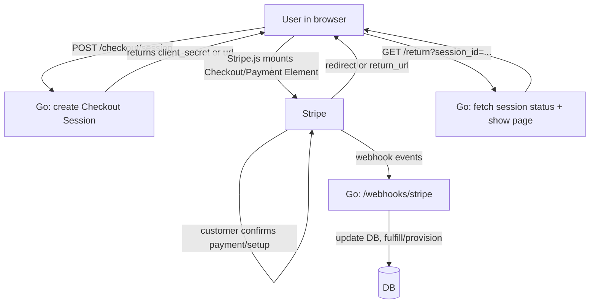

# Stripe Payment Systems Skill (Go + templ + htmx + Tailwind)

A practical, end-to-end guide to building robust payment flows with Stripe, optimized for a Go backend and server-rendered UI (templ + htmx + Tailwind).

> Stripe recommends using **Checkout Sessions API + Payment Element** for most web integrations because it covers many payment flows with less custom code. fileciteturn1file5L5-L26

---

## Mental model: objects & responsibilities

**Core objects**

- **Checkout Session**: the “checkout state machine” for one-time purchases, subscriptions, or setup (future payments). Sessions expire ~24 hours after creation. fileciteturn1file10L33-L36
- **PaymentIntent**: a one-time payment attempt (incl. async/processing methods). You inspect its `status` to decide what the customer sees. fileciteturn2file12L10-L50
- **SetupIntent**: collects and verifies payment details to use later (future/off-session). Setup mode in Checkout creates these. fileciteturn2file13L9-L12
- **PaymentMethod**: the customer’s payment instrument (card/bank/etc.). It can be attached to a **Customer** and reused. fileciteturn1file1L14-L18
- **Customer**: the “owner” of saved payment methods and subscriptions. fileciteturn1file3L42-L49
- **Subscription + Invoice**: recurring billing objects; invoices drive recurring payment attempts. Webhooks tell you what happened. fileciteturn2file12L55-L79

**Payment contexts**

- **On-session**: customer is present and can authenticate (3DS/SCA).
- **Off-session**: customer not present; you must expect failures that require authentication. Stripe uses previous on-session data to attempt exemptions, but it can still fail. fileciteturn1file1L16-L18

---

## Architecture blueprint

### Recommended stack split

- **Browser (templ + htmx)** renders pages and calls your Go endpoints.
- **Go server** creates Sessions / Intents, returns `client_secret`/URLs, stores authoritative state in your DB.
- **Stripe webhooks** are the source of truth for asynchronous completion and billing lifecycle changes. fileciteturn1file9L6-L13

### High-level flow diagram (choose a lane)



---

## Setup: keys, environments, SDK

### Stripe Go SDK

Install `stripe-go` (match the version you use across services). fileciteturn1file10L19-L24

```bash
go get -u github.com/stripe/stripe-go/v84
```

### Environment variables (minimum)

- `STRIPE_SECRET_KEY`
- `STRIPE_PUBLISHABLE_KEY`
- `STRIPE_WEBHOOK_SECRET` (endpoint signing secret, `whsec_...`) fileciteturn1file9L1-L12

---

## Flow 1: Take an immediate payment (one-time)

### When to use

- One-time purchases, donations, fees, event tickets, etc.

### Server: create a Checkout Session (custom UI mode)

Create a Session and return its `client_secret` to the browser. fileciteturn1file10L33-L59

```go
sc := stripe.NewClient(os.Getenv("STRIPE_SECRET_KEY"))

params := &stripe.CheckoutSessionCreateParams{
  UIMode: stripe.String(stripe.CheckoutSessionUIModeCustom),
  Mode:   stripe.String(stripe.CheckoutSessionModePayment),

  LineItems: []*stripe.CheckoutSessionCreateLineItemParams{
    {
      PriceData: &stripe.CheckoutSessionCreateLineItemPriceDataParams{
        Currency: stripe.String(stripe.CurrencyUSD),
        ProductData: &stripe.CheckoutSessionCreateLineItemPriceDataProductDataParams{
          Name: stripe.String("T-shirt"),
        },
        UnitAmount: stripe.Int64(2000),
      },
      Quantity: stripe.Int64(1),
    },
  },

  // For embedded/custom flows, use return_url; Stripe will substitute {CHECKOUT_SESSION_ID}
  ReturnURL: stripe.String("https://example.com/return?session_id={CHECKOUT_SESSION_ID}"),
}

sess, err := sc.V1CheckoutSessions.Create(context.TODO(), params)
if err != nil { /* handle */ }

// send sess.ClientSecret to the browser
```

### Client: load Stripe.js and initialize

Load Stripe.js from `js.stripe.com` (don’t bundle). fileciteturn1file10L65-L75

```html
<script src="https://js.stripe.com/clover/stripe.js"></script>
```

```js
const stripe = Stripe("<<YOUR_PUBLISHABLE_KEY>>");
```

### Client: mount and confirm (Checkout Sessions + Payment Element)

Stripe’s docs describe an HTML flow:

- `checkout = stripe.initCheckout({ clientSecret })`
- `paymentElement = checkout.createPaymentElement()`
- `actions = (await checkout.loadActions()).actions; await actions.confirm();` fileciteturn1file5L5-L6

**Pseudo-code you can wrap in your own JS module:**

```js
const checkout = await stripe.initCheckout({ clientSecret });
const paymentElement = checkout.createPaymentElement();
paymentElement.mount("#payment-element");

document.querySelector("#pay").addEventListener("click", async () => {
  const { actions } = await checkout.loadActions();
  const { error } = await actions.confirm(); // handles redirects if needed
  if (error) showError(error.message);
});
```

### Return page: show status

When redirect returns, fetch status and show a user-friendly message by inspecting `PaymentIntent.status`. fileciteturn2file12L10-L52

---

## Flow 2: Set up for future payments (no immediate charge)

### When to use

- Store a card/bank for later invoicing
- Security deposits
- “Pay later” ordering
- Collect card before a trial ends

### Key idea

Use **Checkout setup mode** (`mode=setup`). Setup mode uses **SetupIntents** to create PaymentMethods. fileciteturn2file13L9-L12

### Server: create setup-mode Checkout Session

In setup mode, **Dynamic payment methods** requires `currency`. fileciteturn2file13L50-L51

```go
params := &stripe.CheckoutSessionCreateParams{
  Mode:     stripe.String(stripe.CheckoutSessionModeSetup),
  Currency: stripe.String(stripe.CurrencyUSD),
  Customer: stripe.String("{{CUSTOMER_ID}}"), // optional: attach to existing customer
  SuccessURL: stripe.String("https://example.com/success?session_id={CHECKOUT_SESSION_ID}"),
}
sess, err := sc.V1CheckoutSessions.Create(ctx, params)
```

fileciteturn2file13L54-L65

### Webhook: get SetupIntent & PaymentMethod

`checkout.session.completed` includes a `setup_intent` id in setup mode. fileciteturn2file16L18-L35

Retrieve SetupIntent → get its `payment_method` id. fileciteturn2file16L36-L47

Then (if needed) attach PaymentMethod to a Customer and charge later off-session using a PaymentIntent. fileciteturn1file1L14-L33

---

## Flow 3: Save payment method during a one-time checkout

### A) Save to charge off-session later (setup_future_usage)

For one-time payments, payment methods aren’t reusable by default. fileciteturn2file0L3-L7

Set `payment_intent_data.setup_future_usage = "off_session"` to save for later. fileciteturn2file0L7-L35

```go
params := &stripe.CheckoutSessionCreateParams{
  CustomerCreation: stripe.String(stripe.CheckoutSessionCustomerCreationAlways),
  Mode: stripe.String(stripe.CheckoutSessionModePayment),
  UIMode: stripe.String(stripe.CheckoutSessionUIModeEmbedded),
  ReturnURL: stripe.String("https://example.com/return"),
  // line_items...
  PaymentIntentData: &stripe.CheckoutSessionCreatePaymentIntentDataParams{
    SetupFutureUsage: stripe.String("off_session"),
  },
}
```

fileciteturn2file0L13-L35

**Important UX/legal note:** saving payment details can impact privacy compliance; involve counsel. fileciteturn2file0L37-L40

### B) Save so Checkout can prefill it on future purchases (payment_method_save)

If you want **Checkout itself** to offer a “save for next time” checkbox and prefill later, use:

- `saved_payment_method_options.payment_method_save = enabled` fileciteturn2file5L22-L33
- requires a **Customer**; set `customer_creation=always` if you don’t already have one. fileciteturn2file5L33-L34

When the customer opts in, Stripe saves with `allow_redisplay: always`. fileciteturn2file5L29-L30

---

## Flow 4: Manage saved payment methods (Payment Element + Customer Session)

### What “saved payment methods” means

You can save payment methods on the **Customer** and show them later via the Payment Element’s saved PM feature. fileciteturn2file2L7-L13

Key behavior:

- If the “Save payment details…” checkbox is selected when confirming, `allow_redisplay` becomes `always`.
- If not selected, `allow_redisplay` becomes `limited` (can’t be used for future purchases). fileciteturn2file1L20-L23

### Re-collect CVC (extra security)

You can require CVC re-collection via `require_cvc_recollection`. fileciteturn2file1L10-L17

### Prevent “remove payment method” from breaking subscriptions

Removing a saved PM from the Payment Element can remove it from an active subscription. Stripe recommends disabling removal in the Payment Element and managing changes in a dedicated settings page instead. fileciteturn2file1L26-L29

### Showing older saved payment methods

Older payment methods might have `allow_redisplay: unspecified` and won’t show.
Options:

- Update individual PMs to `allow_redisplay=always`, if consent was obtained.
- Or configure Customer Session to include `unspecified` methods. fileciteturn2file1L30-L40

---

## Flow 5: Create subscriptions (recurring)

### Recommended approach

Use **Checkout Sessions API + Payment Element** to sell fixed-price subscriptions. This reduces custom code and adds built-in support for tax/discounts/shipping/currency conversion. fileciteturn1file8L5-L7

### Subscription basics you must model

- **Products + Prices** in Stripe (your “catalog”)
- A **Customer** in your system and in Stripe
- A subscription “plan” mapping between your DB and Stripe price IDs fileciteturn1file8L17-L22

### Payment method collection & free trials

For subscription mode, Checkout can avoid collecting a payment method if the total due is 0 (for trials/discounts) via `payment_method_collection=if_required`. fileciteturn2file9L13-L25

### Confirm & return

Stripe appends `payment_intent_client_secret` to your `return_url`; you can retrieve and inspect the PaymentIntent to show status. fileciteturn2file8L6-L23

### Webhooks: subscription lifecycle

At minimum, handle:

- `invoice.paid` to provision after trial ends / payment succeeds. fileciteturn1file16L65-L70
- `invoice.payment_failed` to notify user & collect new PM; subscription becomes `past_due`. fileciteturn1file16L73-L77
- `customer.subscription.deleted` to deprovision access. fileciteturn1file16L81-L85

---

## Flow 6: Charge later (off-session)

### When to use

- Metered/usage fees you calculate later
- No-show/cancellation fees
- Renewals outside active subscriptions (be careful—subscriptions may be better)

### Steps (typical)

1. Ensure you have a **Customer** and a **saved PaymentMethod** (via setup mode or setup_future_usage).
2. Create a PaymentIntent with:
   - `customer`
   - `payment_method`
   - `off_session=true`
   - `confirm=true` fileciteturn1file1L16-L33

```go
params := &stripe.PaymentIntentCreateParams{
  Amount:        stripe.Int64(1099),
  Currency:      stripe.String(stripe.CurrencyUSD),
  Customer:      stripe.String(customerID),
  PaymentMethod: stripe.String(paymentMethodID),
  OffSession:    stripe.Bool(true),
  Confirm:       stripe.Bool(true),
}
pi, err := sc.V1PaymentIntents.Create(ctx, params)
```

fileciteturn1file1L20-L33

**Operational reality:** off-session payments can fail if authentication is required. Your system must surface a “fix payment method” flow.

---

## Webhooks: design, security, and reliability

### Why webhooks are required

Webhooks let you respond to async events: bank confirms, disputes, recurring payments, etc. fileciteturn1file0L34-L37

### Rule #1: verify signatures

Stripe requires the **raw body** to verify; any manipulation breaks verification. fileciteturn1file14L49-L49

**Go signature verification (recommended):**

```go
func handleStripeWebhook(w http.ResponseWriter, r *http.Request) {
  if r.Method != http.MethodPost {
    http.Error(w, "method not allowed", http.StatusMethodNotAllowed)
    return
  }

  payload, err := io.ReadAll(io.LimitReader(r.Body, 65536))
  if err != nil {
    http.Error(w, "read body failed", http.StatusBadRequest)
    return
  }

  secret := os.Getenv("STRIPE_WEBHOOK_SECRET")
  event, err := webhook.ConstructEvent(payload, r.Header.Get("Stripe-Signature"), secret)
  if err != nil {
    http.Error(w, "bad signature", http.StatusBadRequest)
    return
  }

  // ACK quickly; do heavy work async
  w.WriteHeader(http.StatusOK)

  go processEvent(event)
}
```

fileciteturn1file9L6-L13 fileciteturn1file16L46-L63

### Rule #2: ACK fast, process safely

Stripe recommends returning `2xx` quickly, before heavy logic. fileciteturn0file5L1-L9

### Rule #3: idempotency & deduplication

Implement dedupe by **event ID** in your DB. Webhooks can retry.

Suggested DB table:

- `stripe_event_id` (unique)
- `type`
- `created`
- `processed_at`
- `status`
- `related_object_ids` (payment_intent, invoice, subscription, customer)

### Snapshot vs thin events (API v1 vs v2)

Stripe differentiates “snapshot” (deserialize `event.data.object`) vs “thin” events where you fetch related objects. fileciteturn0file5L40-L45

### Manual verification (only if you must)

Stripe-Signature has `t=...` and `v1=...`; ignore non-`v1` schemes. Stripe uses HMAC SHA-256. fileciteturn1file9L50-L63

---

## Go + templ + htmx patterns that work well

### 1) “Create session” endpoint returns JSON to htmx

- `POST /stripe/session` returns `{ clientSecret }`
- htmx swaps in a `<div>` containing the payment element + JS bootstrap.

**Example response shape:**

```json
{ "clientSecret": "cs_test_..." }
```

(Stripe examples show returning `client_secret` for embedded/custom flows.) fileciteturn2file10L11-L12

### 2) Return page is server-rendered, status is server-derived

Use `session_id={CHECKOUT_SESSION_ID}` in `return_url` so you can retrieve session status. fileciteturn2file10L5-L6

### 3) Tailwind-only styling + Stripe Appearance API

Stripe Elements supports CSS-level customization via the Appearance API. fileciteturn1file10L9-L12  
(Use Tailwind for your app UI; use Appearance for the embedded payment component.)

---

## “Which flow should I choose?” decision cheat sheet

| Use case                                      | Best Stripe primitives                                                                                                  |
| --------------------------------------------- | ----------------------------------------------------------------------------------------------------------------------- |
| One-time purchase now                         | Checkout Session `mode=payment` + Payment Element                                                                       |
| Save card for later billing (no charge now)   | Checkout Session `mode=setup` → SetupIntent → attach PM                                                                 |
| One-time now + save for later off-session fee | Checkout Session `mode=payment` + `payment_intent_data.setup_future_usage=off_session` fileciteturn2file0L7-L35     |
| Let user opt-in to save & prefill next time   | Checkout Session + `saved_payment_method_options.payment_method_save=enabled` fileciteturn2file5L29-L34             |
| Recurring subscription                        | Checkout Session `mode=subscription` + webhooks (`invoice.*`, `customer.subscription.*`) fileciteturn1file16L65-L85 |
| Usage/fees later                              | Off-session PaymentIntent with saved PM fileciteturn1file1L16-L33                                                   |

---

## Production checklist (don’t skip)

### Security

- Verify every webhook signature using the raw body. fileciteturn1file14L49-L49
- Separate publishable vs secret keys; never expose secret keys to the browser.
- Limit request bodies for webhook endpoints (example uses 65,536 bytes). fileciteturn1file0L61-L66

### Reliability

- Store Stripe IDs in your DB: `customer`, `payment_intent`, `setup_intent`, `subscription`, `invoice`, plus your own `order_id`.
- Dedupe webhook events by `event.id`.
- Implement retries for Stripe API calls; keep your webhook handler fast.

### Customer experience

- For redirect-based PMs, use `return_url` and show a clear return page.
- For subscription failures, notify and provide a “update payment method” path. fileciteturn1file16L73-L77

### Compliance & disclosure

- Disclose Stripe’s data collection and obtain appropriate consents when using Elements. fileciteturn1file12L7-L9
- For saving payment methods, involve legal/privacy (Stripe explicitly recommends it). fileciteturn2file0L37-L40

---

## Appendix: handy knobs in Checkout Session creation

A few parameters you’ll commonly use:

- `customer` / `customer_creation` controls Customer creation & reuse. fileciteturn1file3L42-L48
- `saved_payment_method_options.*`:
  - `allow_redisplay_filters` controls which saved PMs can show. fileciteturn2file7L36-L50
  - `payment_method_save` / `payment_method_remove` toggles save/remove UI. fileciteturn2file14L7-L39
- `redirect_on_completion` when `ui_mode=embedded` (always/if_required/never). fileciteturn1file2L21-L31
- Subscription-specific: `payment_method_collection=if_required` for trials. fileciteturn2file9L13-L25
- Connect payouts:
  - `payment_intent_data.transfer_data.destination` / `transfer_group` for connected accounts. fileciteturn2file9L1-L12

---

## Minimal “event map” for most apps

Start with these webhook event types:

- **Checkout**: `checkout.session.completed` (capture session → payment_intent/setup_intent/subscription) fileciteturn2file16L18-L35
- **Payments**: `payment_intent.succeeded`, `payment_intent.payment_failed` (if used)
- **Billing**: `invoice.paid`, `invoice.payment_failed`, `customer.subscription.deleted` fileciteturn1file16L65-L85
- **Payment methods**: `payment_method.attached` (audit / profile updates) fileciteturn1file9L26-L35

---

## What to implement first (sequence)

1. **One-time payment** with Checkout Session + return page.
2. Add **webhooks** + DB state updates.
3. Add **setup mode** (future payments).
4. Add **off-session charge** endpoint (admin/cron-driven).
5. Add **subscriptions** + invoice webhooks.
6. Add **saved payment methods UX** (payment_method_save / Payment Element saved PMs).
